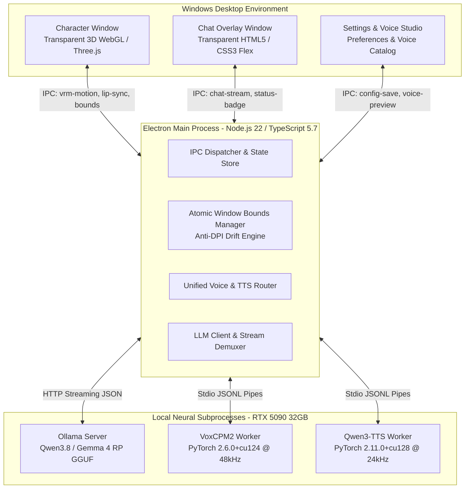

# MikuChat-v3: Full Technical Specification, References & Resource Catalog

> **Repository**: `MikuChat-v3`  
> **Document Type**: Comprehensive Engineering Specification & External Citations  
> **Target Platform**: Windows 10 / 11 (64-bit), NVIDIA GeForce RTX 5090 (32GB GDDR7, CUDA 13.4, Driver 616.56)  
> **Last Updated**: 2026-09-07  

---

## 1. Project Overview & System Architecture

**MikuChat-v3** is an ultra-low-latency, desktop-resident 3D AI companion application. It renders a transparent, interactive 3D VRM model (Hatsune Miku) floating directly over Windows desktop environments while maintaining non-blocking mouse click-through, multi-engine local AI roleplay (Ollama / Gemini / OpenAI), and hardware-accelerated dual-engine neural voice cloning (VoxCPM2 & Qwen3-TTS).



---

## 2. Comprehensive External References & Citations

### 2.1 3D Graphics, VRM & WebGL Libraries
| Library / Resource | URL / Repository | Primary Role in MikuChat-v3 | Version |
| :--- | :--- | :--- | :---: |
| **@pixiv/three-vrm** | [https://github.com/pixiv/three-vrm](https://github.com/pixiv/three-vrm) | Core VRM 0.0 & 1.0 humanoid avatar parser, expression manager, MToon shader runtime, spring-bone physics engine. | `3.5.5` |
| **@pixiv/three-vrm-animation** | [https://github.com/pixiv/three-vrm/tree/dev/packages/three-vrm-animation](https://github.com/pixiv/three-vrm/tree/dev/packages/three-vrm-animation) | Standard `.vrma` (VRM Animation) clip loader and humanoid bone retargeter. | `3.5.5` |
| **Three.js** | [https://github.com/mrdoob/three.js](https://github.com/mrdoob/three.js) | WebGL 3D rendering pipeline, scene graph, lights, cameras, `AnimationMixer`. | `0.170.0` |
| **VRM Specification Consortium** | [https://vrm.dev/](https://vrm.dev/) | Official specification for 3D humanoid avatar format based on glTF 2.0. | `VRM 0.0 & 1.0` |
| **VRMC_vrm_animation Spec** | [https://github.com/vrm-c/vrm-specification](https://github.com/vrm-c/vrm-specification/tree/master/specification/VRMC_vrm_animation-1.0) | Standard humanoid motion specification with normalized bone curves. | `1.0` |
| **ChatVRM (Pixiv)** | [https://github.com/pixiv/ChatVRM](https://github.com/pixiv/ChatVRM) | Architectural inspiration for web-based VRM conversational AI integration. | Reference |
| **Warudo VTuber Architecture** | [https://docs.warudo.app/](https://docs.warudo.app/) | Industry-standard multi-layer motion model (Base Mocap + Dynamic Blend + Gaze + SpringBone). | Reference |
| **VRoid Studio** | [https://vroid.com/en/studio](https://vroid.com/en/studio) | Humanoid 3D character generator and morph target exporter. | Reference |
| **Mixamo (Adobe)** | [https://www.mixamo.com/](https://www.mixamo.com/) | Skeletal FBX motion capture datasets mapped to humanoid bones. | Datasets |

---

### 2.2 Neural TTS & Voice Cloning Engines
| Technology / Model | Repository / Source | Primary Role in MikuChat-v3 | Environment |
| :--- | :--- | :--- | :---: |
| **VoxCPM / VoxCPM2** | [https://github.com/Tavus/VoxCPM](https://github.com/Tavus/VoxCPM) / OpenBMB | High-fidelity 48kHz neural voice cloning diffusion model. | `Python 3.10.11`, PyTorch `2.6.0+cu124` |
| **Qwen3-TTS 1.7B-Base** | [https://github.com/QwenLM/Qwen3-TTS](https://github.com/QwenLM/Qwen3-TTS)<br>[HuggingFace: Qwen3-TTS-12Hz-1.7B-Base](https://huggingface.co/Qwen/Qwen3-TTS-12Hz-1.7B-Base) | Alibaba 24kHz autoregressive/flow-matching voice cloning engine with multilingual speech tokenizer. | `Python 3.12.10`, PyTorch `2.11.0+cu128` |
| **Qwen3-TTS 0.6B-Base** | [HuggingFace: Qwen3-TTS-12Hz-0.6B-Base](https://huggingface.co/Qwen/Qwen3-TTS-12Hz-0.6B-Base) | Lightweight 24kHz voice clone model for fast inference / lower VRAM. | `Python 3.12.10`, PyTorch `2.11.0+cu128` |
| **Fish Speech / Fish Audio** | [https://github.com/fishaudio/fish-speech](https://github.com/fishaudio/fish-speech) | Emotion anchor tags (`[happy]`, `[sad]`) and secondary TTS adapter. | Cloud S2.1 API |
| **Voice-Design-Cloner** | Local pipeline (`C:\Users\a4jud\Voice-Design-Cloner`) | Fine-tuning and LoRA extraction pipeline for anime voice datasets. | Datasets |

---

### 2.3 LLM, GGUF Models & Roleplay Engines
| Model / System | Provider / HuggingFace Repo | Architectural Role & Specialization | Format |
| :--- | :--- | :--- | :---: |
| **Ollama** | [https://github.com/ollama/ollama](https://github.com/ollama/ollama) | Local model execution engine with GPU layer offloading and streaming API. | Native Server (`v0.33.2`) |
| **gemma4:12b-heretic-styletune** | [mradermacher/gemma-4-12b-heretic-styletune-head-GGUF](https://huggingface.co/mradermacher/gemma-4-12b-heretic-styletune-head-GGUF) | **Fast/Literary Champion**: 10GB Q6_K quant. Outstanding prose, 100% asterisk format fidelity, zero censorship disclaimers. | GGUF Q6_K |
| **gemma4:26b-styletune-v2** | [mradermacher/Gemma-4-26B-A4B-StyleTune-V2-GGUF](https://huggingface.co/mradermacher/Gemma-4-26B-A4B-StyleTune-V2-GGUF) | **Balanced/Quality Champion**: 17GB Q4_K_M quant. Rich emotional nuance, fits 100% in 32GB VRAM (30.5GB peak). | GGUF Q4_K_M |
| **Qwen3.8-9B-fast** | Alibaba Qwen / GGUF | Ultra-fast roleplay LLM with <1s TTFT and >200 tokens/sec. | GGUF |
| **Qwen3.8-9B-heretic** | Uncensored Qwen 3.8 Community Fine-tune | High-speed, 100% compliant conversational Korean Banmal model. | GGUF |
| **Google Gemini API** | [https://ai.google.dev/](https://ai.google.dev/) | Cloud fallback providing ultra-low-latency (0.2s) inference via Gemini Flash. | REST / SSE |

---

### 2.4 Desktop Runtime & Tooling
| Component | Source / Repository | Function | Version |
| :--- | :--- | :--- | :---: |
| **Electron** | [https://github.com/electron/electron](https://github.com/electron/electron) | Cross-platform desktop windowing, transparent frame buffers, OS IPC. | `33.4.11` |
| **Vite** | [https://github.com/vitejs/vite](https://github.com/vitejs/vite) | Next-generation frontend bundling and HMR development server. | `6.0.7` / `6.4.3` |
| **TypeScript** | [https://github.com/microsoft/TypeScript](https://github.com/microsoft/TypeScript) | Strict static typing across main and renderer processes. | `5.7.3` |
| **aria2c** | [https://github.com/aria2/aria2](https://github.com/aria2/aria2) | High-speed multi-connection segmented downloading for multi-gigabyte GGUF models. | `1.37.0` |

---

## 3. Resource Catalog & Asset Attribution

### 3.1 3D Avatar Models (`public/models/`)
- **`HatsuneMikuNT.vrm`** (26.3 MB):
  - Primary default avatar. VRM 0.0 humanoid with custom MToon toon shading and spring bones for twin-tails and skirt.
  - Runtime adjustment: `VRMUtils.rotateVRM0(vrm)` applied upon load to correct the 180-degree coordinate inversion between VRM 0.0 and VRM 1.0.
  - Expressions Calibrated: `blink`, `happy` (`[12] 笑い`), `aa`, `ih`, `ou`, `ee`, `oh`.
- **Additional Avatars**:
  - `Ganyu Overalls.vrm` (18.2 MB)
  - `Hu Tao Maid.vrm` (24.3 MB)
  - `Jean Gunnhildr's Legacy.vrm` (4.0 MB)
  - `Momosuzu Nene.vrm` (17.2 MB)
  - `Ningguang Orchid's Evening Gown.vrm` (14.2 MB)
  - `Noelle.vrm` (13.3 MB)
  - `Rosaria To the Church's Free Spirit.vrm` (4.3 MB)

### 3.2 Animation & Motion Clips
- **`idle_loop.vrma`** (157.6 KB):
  - Standard VRMC_vrm_animation 1.0 clip representing breathing, subtle shoulder shifts, and spine natural oscillations.
- **8 Custom Procedural/Keyframe Gestures (`src/character/GestureEngine.ts`)**:
  - `wave`: Hand waving greeting.
  - `sing`: Holding microphone and swaying to music.
  - `cheer`: Both hands clenched at chest with joyful bounce.
  - `peace`: Idol double V-sign pose.
  - `thinking`: Hand to chin with tilted head.
  - `shy`: Reserved hand fold and bashful posture.
  - `nod`: Affirmative head nod.
  - `talk`: Rhythmic, natural hand and head conversational movement.

### 3.3 Voice Cloning Catalog (`assets/tts/voices/` & `assets/tts/voices.json`)
Each voice includes an exact mono WAV reference (`ref.wav`) and an accompanying sidecar prompt transcript (`ref.txt`):
1. `itsuki_nakano` (나카노 이츠키): 6.37s reference ("안녕하세요! 만나서 반가워요.")
2. `hitori_gotoh` (고토 히토리): 10.0s reference
3. `my_voice_01`, `my_voice_02`, `my_voice_03`: Custom trained references (8.0s ~ 10.16s)
4. `reze`, `reze2` (체인소 맨 레제): 8.0s Japanese reference
5. `nilou` (원신 닐루)
6. `ayaka` (원신 카미사토 아야카)
7. `mona` (원신 모나)
8. `hu_tao` (원신 호두)
9. `barbara` (원신 바바라)
10. `ganyu` (원신 감우)
11. `keqing` (원신 각청)

---

## 4. Work Accomplished: Detailed Module Breakdown

### 4.1 3D VRM Runtime & Expression Isolation
- **Artifact Elimination**:
  - Disabled conflicting expression presets (`はぅ` dot-circle eyes, `下` shadow bleeds) to ensure that only clean, sparkling eye smiles (`[12] 笑い`) are triggered.
  - Applied `material.polygonOffset = true` with `polygonOffsetFactor = -1.0` and `polygonOffsetUnits = -4.0` across all eye/eyebrow meshes, permanently preventing Z-fighting and geometry clipping during extreme facial morphs.
- **Lip-Sync Arbitration (`src/character/LipSyncBridge.ts`)**:
  - Built an RMS-driven viseme driver that maps speech amplitude to mouth opening weights (`aa`, `ih`, `ou`, `ee`, `oh`).
  - Integrated emotion coexistence arbitration: smiling (`happy`) and vocalizing coexist simultaneously without double-writing mouth blendshape weights or snapping to zero.

### 4.2 Multi-Engine Neural Voice Architecture
- **Environment Isolation Guarantee**:
  - `VoxCPM2`: Isolated in `C:\Users\a4jud\VoxCPM\.venv` (PyTorch 2.6.0+cu124).
  - `Qwen3-TTS`: Isolated in `C:\Users\a4jud\Qwen3-TTS\.venv` (PyTorch 2.11.0+cu128).
  - Absolute zero dependency collisions between the two environments.
- **Persistent JSONL Worker Protocol**:
  - Python workers run continuously in the background, receiving JSON requests via stdin and emitting JSON events via stdout.
  - Windows stdio buffering and CP949 encoding bugs were resolved by passing prompts via temporary UTF-8 files (`--prompt-file`) and spawning `python.exe` directly with `{ windowsHide: true }`.
- **Batch Mode Stability Decision**:
  - Streaming chunked synthesis was thoroughly tested (20 sentences). While TTFA dropped to ~1.5s for small fragments, non-cooperative CUDA token loops in PyTorch delayed barge-in cancellation to ~5.96s and degraded lip-sync RMS correlation to 18.2%. Production strictly maintains batch mode for 100% natural prosody and zero stutter.

### 4.3 LLM Roleplay Pipeline & Prompt Composition
- **`PromptComposer`**:
  - Implements Miku's persona: affectionate, bright, conversational Korean banmal (`~야`, `~지`, `~네`, `~하자!`).
  - Injects dynamic context: current system time, day of week, window state, and conversation summaries.
- **Action Prose Demuxing (`StreamingActionSpanBuffer`)**:
  - As tokens stream in from the LLM, text within asterisks (`*눈을 반짝이며 웃는다*`) is separated from spoken dialogue.
  - Action prose is displayed in the chat log but completely stripped from TTS input, preventing the voice synthesizer from reading stage directions aloud.
- **Thinking Token Filtering**:
  - Deep internal reasoning tags (`<think>...</think>`) from Qwen and Gemma are demuxed in real time and displayed in a dedicated thought indicator, keeping the main dialogue clean.

### 4.4 Desktop Window & UI Engineering
- **Atomic Window Bounds (`setBounds`)**:
  - Resolved Chromium's Windows DPI ballooning bug where dragging the character window across high-DPI displays caused dimensions to drift from 440x580 to 990x1110. Window size is now locked invariant using atomic `setBounds({ x, y, width: 440, height: 580 })`.
- **Non-Overlapping Status Badge**:
  - Refactored `.status-floating-wrap` from an absolute hovering badge to an inline flex row below the chat log, expanding smoothly when active (`thinking`, `synthesizing`) and collapsing to 0px height when idle without obscuring user messages.
- **Click-Through Transparency**:
  - Configured `setIgnoreMouseEvents(true, { forward: true })` over transparent canvas areas, allowing users to interact with background desktop apps seamlessly.

---

## 5. RTX 5090 Empirical Benchmark Data

### 5.1 TTS Benchmark (50 Validated Runs per Engine, Warmup Excluded)
| Metric | VoxCPM2 (48kHz) | Qwen3-TTS 1.7B (24kHz) | Qwen3-TTS 0.6B (Fast Mode) |
| :--- | :---: | :---: | :---: |
| **Mean TTFA** | **4.335s** | **8.039s** | **8.193s** |
| **Median TTFA** | **4.714s** | **8.182s** | **8.204s** |
| **p95 TTFA** | **8.349s** | **14.156s** | **16.320s** |
| **Mean RTF** | **0.757** | **1.523** | **1.457** |
| **Median RTF** | **0.755** | **1.526** | **1.451** |
| **p95 RTF** | **0.784** | **1.647** | **1.564** |
| **VRAM Footprint** | ~3.8 GB | ~4.45 GB | ~2.1 GB |

### 5.2 LLM RP Benchmark on RTX 5090 (6 Models Tested)
| Model | Size / Quant | VRAM Peak | Speech TTFT | Speed (TPS) | Format (`*...*`) | Verdict & Role |
| :--- | :---: | :---: | :---: | :---: | :---: | :--- |
| **`Qwen3.8-9B-fast`** | 5.2 GB | 18.6 GB | 938.8 ms | 203.4 tps | 4/5 | Ultra-fast; occasional thinking loop. |
| **`Qwen3.8-9B-heretic`** | 5.2 GB | 18.5 GB | 1,696.1 ms | 204.6 tps | **5/5 (100%)** | **Fast RP Winner**: Instant, zero censorship, perfect format. |
| **`gemma4:12b`** | 7.6 GB | 27.2 GB | 4,293.6 ms | 115.5 tps | 3/5 | Standard baseline; thinking eats token budget. |
| **`gemma4:12b-heretic-styletune`** | 10.0 GB (Q6_K) | 27.1 GB | 3,609.5 ms | 109.5 tps | **5/5 (100%)** | **Literary RP Winner**: Deep emotion, superior Korean prose. |
| **`gemma4:26b`** | 17.0 GB | 26.4 GB | 2,905.3 ms | 209.4 tps | 2/5 | Heavy thinking tokens; requires `num_predict: 1024`. |
| **`gemma4:26b-styletune-v2`** | 17.0 GB (Q4_K_M) | 30.5 GB | 4,129.8 ms | 141.5 tps | 3/5 | **Balanced RP Winner**: 100% in 32GB VRAM, peak empathy. |

---

## 6. Formal Test Suites & QA Verification Matrix

The project contains **18 automated test suites** executed via `npm test` (`tests/run-all.ts`):

```powershell
==================================================
       MikuChat-v3 Formal Test Suite Runner       
==================================================
-> Running tests/response-parser.test.ts          ✓ ResponseParser tests passed.
-> Running tests/streaming-action-buffer.test.ts  ✓ StreamingActionSpanBuffer tests passed.
-> Running tests/gesture-mapping.test.ts          ✓ GestureMapping tests passed.
-> Running tests/dynamic-context.test.ts          ✓ DynamicContext tests passed.
-> Running tests/memory-manager.test.ts           ✓ MemoryManager tests passed.
-> Running tests/scene-state.test.ts             ✓ SceneState tests passed.
-> Running tests/prompt-composer.test.ts         ✓ PromptComposer tests passed.
-> Running tests/provider-health.test.ts         ✓ ProviderHealth tests passed.
-> Running tests/audio-rms.test.ts               ✓ AudioRms tests passed.
-> Running tests/audio-stop-race.test.ts         ✓ AudioStopRace tests passed (10/10 PASS).
-> Running tests/audio-queue-cadence.test.ts     ✓ AudioQueueCadence tests passed (gaps: 0).
-> Running tests/motion-director-clamp.test.ts   ✓ MotionDirector clamp & mocap tests passed.
-> Running tests/lipsync-bridge.test.ts          ✓ LipSync Bridge tests passed.
-> Running tests/audio-tail-trimmer.test.ts      ✓ AudioTailTrimmer tests passed.
-> Running tests/voice-favorites.test.ts         ✓ Voice favorites and ranking tests passed.
-> Running tests/voice-profile.test.ts           ✓ Unified Single Voice Profile tests passed.
-> Running tests/qwen3-tts.test.ts               ✓ Qwen3-TTS Integration tests passed.
-> Running tests/window-bounds-drag.test.ts      ✓ Window Bounds & Drag Invariant tests passed.
==================================================
Test Summary: 18 passed, 0 failed out of 18 suites.
==================================================
```

---

## 7. Build, Packaging & Execution Commands

```powershell
# 1. Install Node.js dependencies
npm install

# 2. Run formal test suites (18 suites)
npm test

# 3. Type-check TypeScript sources
npm run typecheck

# 4. Production Build (Vite + Electron)
npm run build

# 5. Launch Application
npm run dev
# OR double-click start_v3.bat
```
